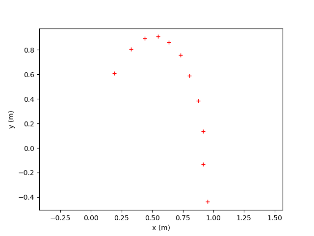

# analyse-video
## Résumé
Application web de pointage de vidéo pour l'étude du mouvement. 


Après avoir chargé une vidéo d'un mouvement, on choisit la fréquence des images, on calibre l'échelle des longueurs grâce à un étalon, on choisit l'origine des temps et du repère, puis on pointe image par image la position d'un objet en mouvement. 

Il est ensuite possible d'exporter les coordonnées des positions x(t) et y(t) sous format .csv ou sous forme d'un script Python traçant la trajectoire.

L'exportation se fait via le presse papier par système de copier/coller.

## Chargement d'une vidéo
Seules les vidéos aux formats compatibles avec le HTML5 sont prises en charge: `mp4`, `webm` et `ogg`.

Le bouton `Parcourir` permet de choisir un fichier vidéo stocké localement sur un disque ou sur un réseau.

On réglera également la fréquence des images à 10 i/s , 20 i/s ou 30 i/s.

On peut faire défiler image par image la vidéo à l'aide des boutons `Reculer` et `Avancer`.

## Étalonnage de l'échelle des longueurs
On active ce mode en cliquant sur le bouton `Étalonnage` qui bascule en couleur jaune.

On pointe ensuite le début de l'étalon de longueur avec la souris et *en maintenant enfoncé le bouton gauche*, on traîne la souris jusqu'à l'autre extrémité de l'étalon puis on lâche le bouton. Un trait jaune matérialise l'étalon de longueur choisi. 

On renseigne également la valeur de la longueur de l'étalon ainsi que l'unité utilisée.

On sort du mode étalonnage en cliquant sur le bouton `Étalonnage`, il redevient gris.

## Choix de l'origine des temps et de l'espace
On se place au départ sur l'image correspondant à notre origine des temps à l'aide des boutons avancer/reculer.

On bascule ensuite  en mode choix de l'origine en cliquant sur le bouton `Origine` qui passe en jaune.

On clique ensuite sur la vidéo pour positionner l'origine du repère. Elle est matérialisée par un petit système d'axe Oxy.

On quitte le mode origine en cliquant sur le bouton `Origine` qui redevient gris.

## Pointage du mouvement
On bascule dans le mode pointage en cliquant sur le bouton `Pointage` qui devient jaune.

On clique ensuite sur la vidéo sur l'objet dont on suit le mouvement, une croix rouge matérialise la position sur la trajectoire.

On peut supprimer le point de l'image courante ou supprimer l'ensemble des points.

L'exportation permet de coller dans le presse papier un texte qui correspond
  - à une table au format .csv avec le temps , la position x et la position y
  - à un script Python qui stocke les valeurs du temps et des positions dans trois listes et qui affiche la trajectoire avec MathPlot

On appuie sur le bouton `Exporter .csv` ou `Exporter .py` , et une copie des valeurs est faite dans le presse papier. Il faut ensuite faire un coller du texte dans une application capable de gérer le csv ou le script Python.

## Exemple
Copie d'écran d'une analyse de vidéo

Code .csv généré dans le presse papier
```
t(s);x(m);y(m)
0,000;0,189;0,608
0,100;0,327;0,804
0,200;0,438;0,895
0,300;0,549;0,908
0,400;0,634;0,862
0,500;0,732;0,758
0,600;0,804;0,588
0,700;0,876;0,385
0,800;0,915;0,137
0,900;0,915;-0,131
1,000;0,954;-0,438

```

Code Python généré dans le presse papier
```
t = [
    0.000, 0.100, 0.200, 0.300, 0.400, 0.500, 
    0.600, 0.700, 0.800, 0.900, 1.000, 
    ]

x = [
    0.189, 0.327, 0.438, 0.549, 0.634, 0.732, 
    0.804, 0.876, 0.915, 0.915, 0.954, 
    ]

y = [
    0.608, 0.804, 0.895, 0.908, 0.862, 0.758, 
    0.588, 0.385, 0.137, -0.131, -0.438, 
    
    ]

import matplotlib.pyplot as plt
plt.plot(x , y, 'r+' )
plt.axis('equal')
plt.xlabel('x (m)')
plt.ylabel('y (m)')
plt.show()

```


